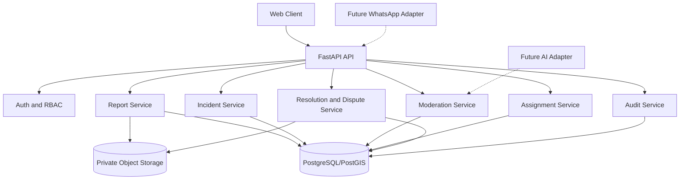

# System Architecture

**Project:** SaloneFix  
**Current phase:** Human-First Foundation Launch  
**Next phase:** Human-Only Operational MVP and Baseline  
**Future phase:** Hybrid Human + AI Assistance  
**Scope:** Freetown public-service reporting prototype

## 1. Architecture decision

Use a modular monolith for the first release. A modular monolith is simpler to deploy and test than microservices while preserving clear domain boundaries for future growth.

## 2. Logical architecture

## 3. Backend modules

- `auth`: authentication, sessions, roles, permissions.
- `reports`: report creation, validation, tracking, media links.
- `incidents`: incident creation, report linking, merging.
- `moderation`: review queue, decisions, clarification, escalation.
- `assignments`: institution and officer assignment.
- `resolution`: evidence, resolution review, disputes, reopening.
- `notifications`: persisted event notifications and delivery logs.
- `audit`: append-only event records.
- `integrations`: future WhatsApp and AI adapters.

## 4. Request flow

1. Client submits a request.
2. API authenticates the actor.
3. API validates schema and permissions.
4. Domain service executes a transaction.
5. Original data is persisted.
6. Audit event is created in the same transaction where possible.
7. Asynchronous notifications or analysis are queued.
8. API returns a safe response.

## 5. Human-first boundary

The core domain must not call an AI service to complete a required transition. A report can be reviewed, assigned, resolved, disputed, and closed when the AI adapter is disabled.

## 6. Storage architecture

Store structured records in PostgreSQL. Store original media in private object storage. Store only metadata and storage references in the database. Use signed URLs for authorized temporary access.

## 7. Observability

Log request ID, actor ID where safe, operation, entity ID, outcome, latency, and error code. Do not log image contents, tokens, passwords, or unnecessary personal data.

## 8. Future hybrid boundary

The AI adapter must accept a report ID and return a versioned recommendation. It must not directly change report status, merge incidents, assign institutions, or close cases.

## References

[1]: https://www.w3.org/TR/WCAG22/ "Web Content Accessibility Guidelines 2.2"
[2]: https://owasp.org/www-project-application-security-verification-standard/ "OWASP Application Security Verification Standard"
[3]: https://doi.org/10.6028/NIST.AI.100-1 "NIST Artificial Intelligence Risk Management Framework"
