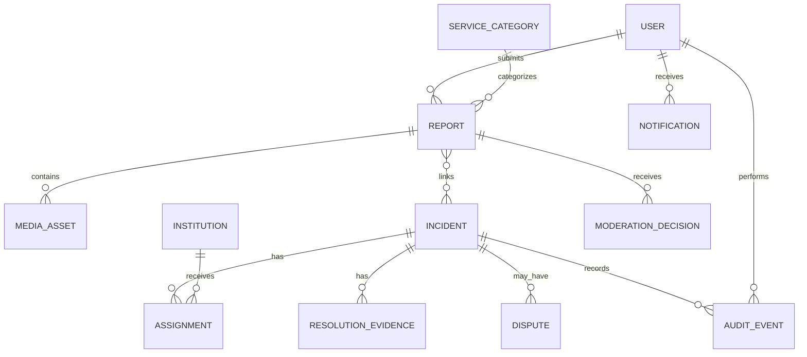

# Domain and Data Model

**Project:** SaloneFix  
**Current phase:** Human-First Foundation Launch  
**Next phase:** Human-Only Operational MVP and Baseline  
**Future phase:** Hybrid Human + AI Assistance  
**Scope:** Freetown public-service reporting prototype

## 1. Core domain distinction

A **report** is an individual citizen submission. An **incident** is the operational case managed by an institution. Multiple reports may describe one incident.

## 2. Entities

### User

Fields: `id`, `role`, `name_or_alias`, `contact`, `password_hash_or_external_id`, `consent_status`, `created_at`, `updated_at`, `is_active`.

### Institution

Fields: `id`, `name`, `description`, `service_area`, `contact_channel`, `is_active`.

### ServiceCategory

Fields: `id`, `code`, `name`, `description`, `requires_resolution_evidence`, `is_active`.

### Report

Fields: `id`, `tracking_reference`, `reporter_id`, `category_id`, `description`, `latitude`, `longitude`, `location_precision`, `submitted_at`, `current_status`, `source_channel`, `original_payload_hash`.

### Incident

Fields: `id`, `category_id`, `title`, `summary`, `priority`, `lifecycle_status`, `centroid_latitude`, `centroid_longitude`, `created_at`, `updated_at`, `closed_at`.

### MediaAsset

Fields: `id`, `report_id_or_evidence_id`, `storage_key`, `mime_type`, `file_size`, `sha256_hash`, `metadata_status`, `created_at`.

### ModerationDecision

Fields: `id`, `report_id_or_incident_id`, `moderator_id`, `decision`, `reason`, `created_at`.

### Assignment

Fields: `id`, `incident_id`, `institution_id`, `officer_id`, `assigned_by`, `assigned_at`, `due_at`, `accepted_at`, `declined_at`, `decline_reason`.

### ResolutionEvidence

Fields: `id`, `incident_id`, `uploader_id`, `description`, `media_id`, `submitted_at`, `review_status`, `reviewer_id`, `review_reason`, `reviewed_at`.

### Dispute

Fields: `id`, `incident_id`, `reporter_id`, `reason`, `media_id`, `status`, `created_at`, `resolved_at`.

### AuditEvent

Fields: `id`, `actor_id`, `entity_type`, `entity_id`, `action`, `previous_value`, `new_value`, `reason`, `request_id`, `created_at`.

## 3. Invariants

- Original report content is not silently overwritten.
- An incident may link many reports.
- A report may link to zero or one active incident in the MVP.
- Only authorized roles can create lifecycle transitions.
- `RESOLVED` requires accepted resolution evidence where the category requires it.
- Audit events are append-only.
- Exact coordinates and media are permission-controlled.

## 4. Status values

`SUBMITTED`, `UNDER_REVIEW`, `NEEDS_CLARIFICATION`, `VERIFIED`, `MERGED`, `REJECTED`, `ASSIGNED`, `IN_PROGRESS`, `RESOLUTION_UNDER_REVIEW`, `RESOLVED`, `DISPUTED`, `ESCALATED`, `CLOSED`.

## References

[1]: https://www.w3.org/TR/WCAG22/ "Web Content Accessibility Guidelines 2.2"
[2]: https://owasp.org/www-project-application-security-verification-standard/ "OWASP Application Security Verification Standard"
[3]: https://doi.org/10.6028/NIST.AI.100-1 "NIST Artificial Intelligence Risk Management Framework"
